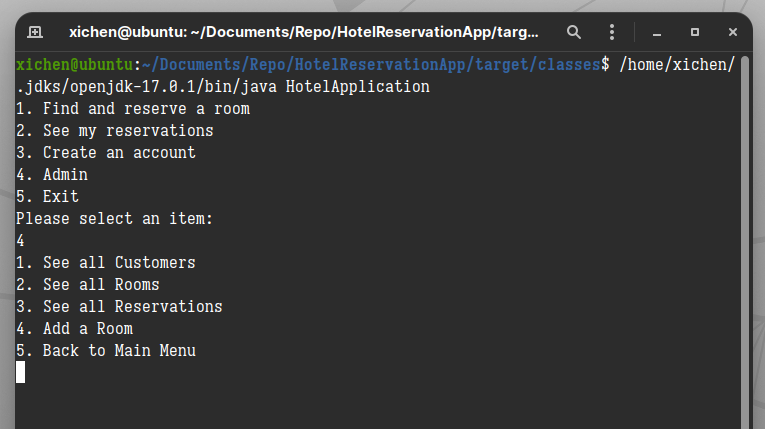
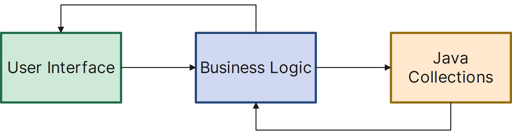
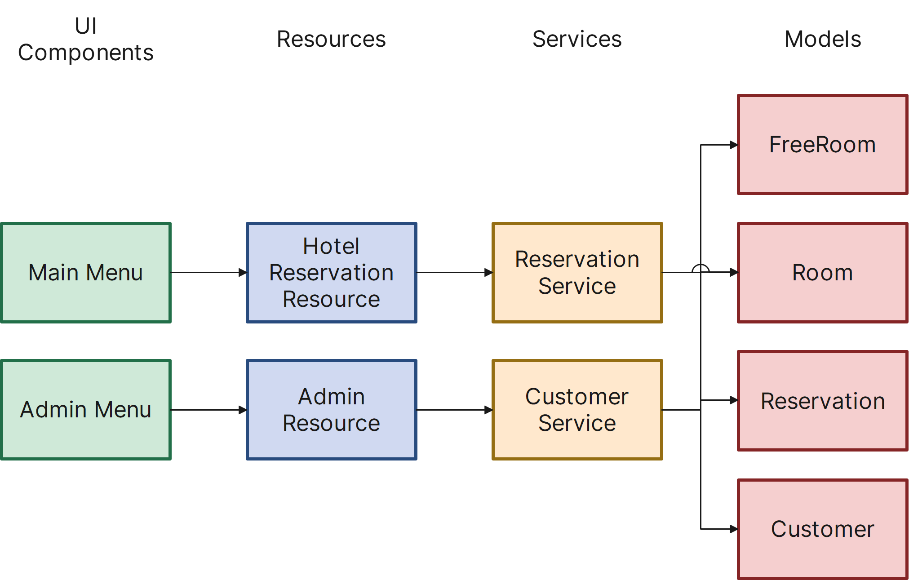

# Hotel Reservation App

This is the Java application that simulates the process of hotel booking. The main menu and the administrator menu are shown below.

## Main Components of the App

The major components of the Hotel Reservation Application will consist of the following:

1. **CLI for the User Interface.** We'll use the *Command Line Interface* (or *CLI* for the user interface. For this, we'll need to have Java monitor the  CLI for user input, so the user can enter commands to search for  available rooms, book rooms, and so on.
2. **Java code.** The second main component is the Java code itself—this is where we add our business logic for the app.
3. **Java collections.** Finally,  we'll use *Java collections* for in-memory storage of the data we need for the app, such as the users' names, room availability, and so on.

## Application Architecture

Let's talk about the structure or architecture of the application. The app will be separated into the following layers:

1. **User interface (UI)**, including a *main menu* for the users who want to book a room, and an *admin menu* for administrative functions.
2. **Resources** will act as our Application Programming Interface (API) to our UI.
3. **Services** will communicate with our resources, and each other, to build the business logic necessary to provide feedback to our UI.
4. **Data models** will be used to represent the domain that we're using within the system (e.g., rooms, reservations, and customers).

